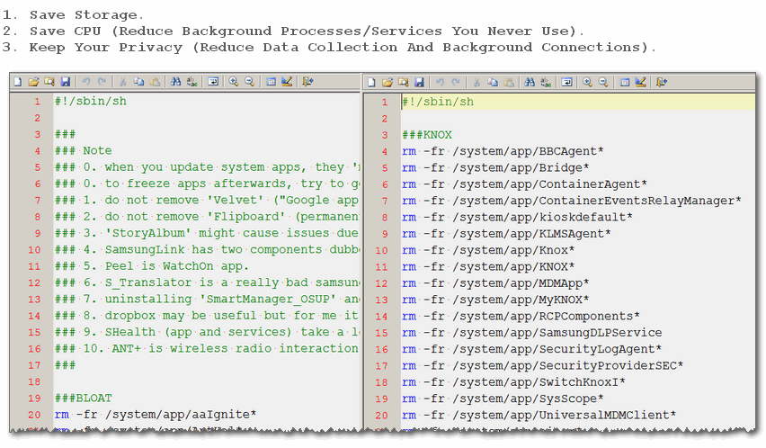
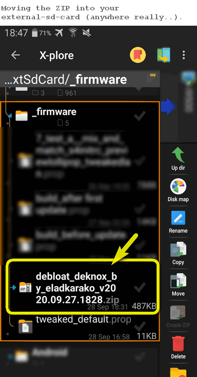
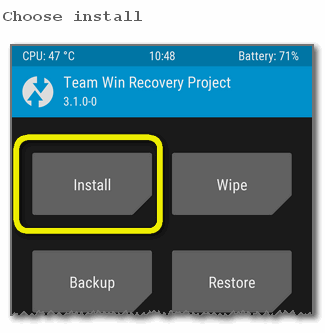
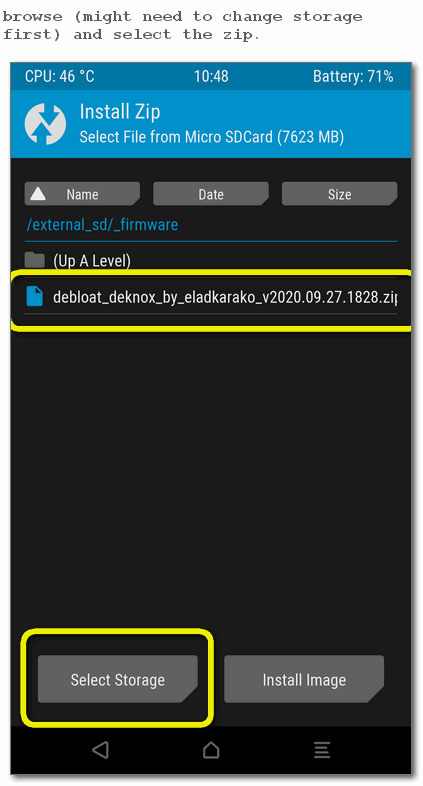
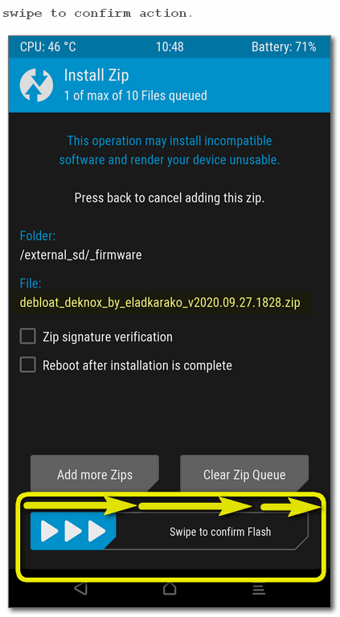
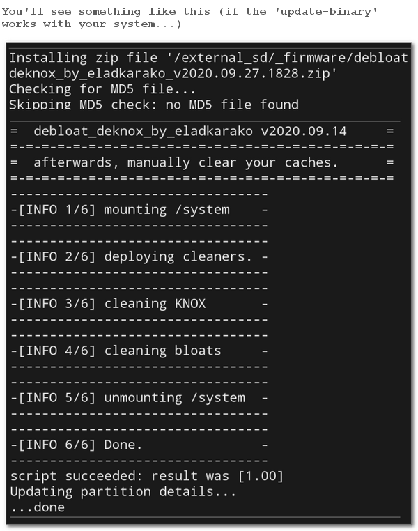
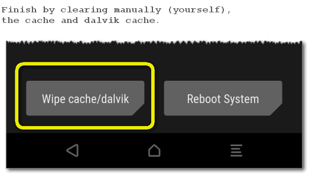
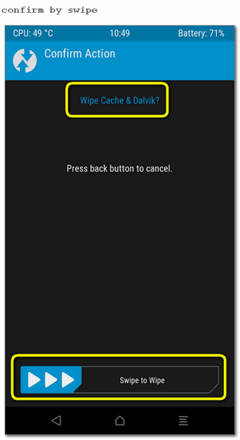
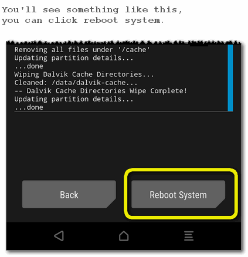

<h1>debloat_deknox_by_eladkarako</h1>

  

<h3>Usage</h3>
Download The Latest ZIP from assets section of <a href="https://github.com/eladkarako/debloat_deknox_by_eladkarako/releases/latest">https://github.com/eladkarako/debloat_deknox_by_eladkarako/releases/latest</a>,  
for example <a href="https://github.com/eladkarako/debloat_deknox_by_eladkarako/releases/download/v2020.09.27.1828/debloat_deknox_by_eladkarako_v2020.09.27.1828.zip">https://github.com/eladkarako/debloat_deknox_by_eladkarako/releases/download/v2020.09.27.1828/debloat_deknox_by_eladkarako_v2020.09.27.1828.zip</a>.  

Place the ZIP in your external-SD-Card.  
Reboot to your custom recovery, choose 'Install', browse for the ZIP and install it.  
clear the Cache and Dalvik Cache and reboot to system.  

  
  
  
  
  
  
  
  

<br/>

<hr/>

<blockquote>
I advise using <code>debloat_deknox_by_eladkarako</code> as soon as possible.  
In an optimal condition, you'll be flashing the original firmware with odin in download-mode without rebooting,  
after that pull out the battery and get into download mode again, with odin selected to not restart flash a modified boot.img set to be permissive,  
repeating the process pull the battery and get into download mode again, flash custom recovery with odin without reboot.  
pull out the battery and go directly into recovery mode,  
there you should flash your custom deodexed-firmware from a zip(best to create non-full installation: framework,app-priv,app,lib,lib64 should be fine),  
followed by installing the <code>debloat_deknox_by_eladkarako</code> ZIP, supersu, busybox and xposed framework libs.  
finally preform a factory reset and reboot to system.
This can reduce the chance of KNOX state flag set.
</blockquote>

<hr/>

<h3>Dependencies</h3>
It relays on a binary file in <code>META-INF/com/google/android/update-binary</code>,  
which runs the Edify script in <code>META-INF/com/google/android/updater-script</code>.  

The custom-recovery already has <code>/sbin/busybox</code> and symlinks to commands (<code>mount</code>, <code>sh</code> and <code>rm</code>) and <code>su</code>,  
it is available to use in the Edify-script, and in any <code>sh</code>-scripts, for the time your are running in the recovery environment (not your system).  


<h3>How it works</h3>
update-binary parse updater-script, which mount <code>/system</code>,  
and copy <code>sh</code>-scripts from the zip's <code>/tools</code> to the recovery <code>/tmp/tools</code>,  
it then <code>chmod</code> it to be owned by <code>root</code> user/group and be runnable,  
it then run them as an argument to <code>/sbin/sh</code>.  

Both <code>/tmp/tools/assist_cleaner_knox.sh</code> and <code>/tmp/tools/assist_cleaner_bloat.sh</code>,  
uses the <code>rm</code> command (a symlink to <code>/sbin/busybox rm</code> usually),  
which allows wildcard-character usage (<code>*</code>) and easier recursive-delete of both files and folders than from within the Edify-script.  

<hr/>

<h3>(OPTIONAL) Additional Advised actions</h3>
In <a href="https://gist.github.com/eladkarako/5694eada31277fdc75cee4043461372e#file-tweaked_default-prop">https://gist.github.com/eladkarako/5694eada31277fdc75cee4043461372e#file-tweaked_default-prop</a>,  
you'll find modified props that can be embedded into <code>boot.img</code>'s default.prop (by means of modifying it with SuperR's Kitchen for example),  
and <code>build.prop</code> which is placed in <code>/system</code>,  
You don't have to modify <code>boot.img</code>, changing the <code>build.prop</code> in your </code>/system</code> is just fine,  
you just copy the values to the head of the file,  
and commenting-out <code>###</code> any existing keys with different values.  
For example: keep <code>ro.config.knox=0</code> and change the line <code>ro.config.knox=v30</code> to <code>###ro.config.knox=v30</code>.  

The modified prop-values also makes the system selinux-permissive, disabling secure storage, and disabling additional KNOX by settings,  
after changing those prop-values you must do a factory-reset, to the data of WiFi storage.

After those changes you are advised to do a factory reset  
(anyway, due to some aspects of secure-storage and encryption the WiFi passwords will be reset as well).
<hr/>

<h2>How To Use As Template? / How To Build?</h2>

I've made sure to make this thing simple,  
<code>7z.exe</code> and <code>zipalign.exe</code> included in the repository <code>/resource</code> folder,  

<ol>
<li>
Download <a href="https://github.com/eladkarako/debloat_deknox_by_eladkarako/archive/master.zip">https://github.com/eladkarako/debloat_deknox_by_eladkarako/archive/master.zip</a>.
</li>
<li>
Extract it to any folder
</li>
<li>
Modify the Edify script, tools and sh-scripts,<br/>
you may try different <code>update-binary</code> (must be renamed <code>update-binary</code>),<br/>
from <code>/resources/alternative-file_update-binary</code> if you are getting an error running the zip afterwards. <br/>
</li>
<li>
Double-click the <code>_build.cmd</code> will create a ready to flash zip,<br/>
under the repository folder, it will ignore <code>.git</code>, <code>.github</code>, <code>resources</code>, <br/>
<code>.gitattributes</code> and other files and folders that are related to the repository, <br/>
and not related to what should be in a flashable-zip, <br/>
it also ignores previously generated builds zip-files, based on their initial-name (but might be of different versions of course). <br/>

It will also 4byte-align the zip, <br/>
which is something required in Android systems to improve reading files. <br/>

You can change <code>set "NAME=debloat_deknox_by_eladkarako"</code> and <br/>
<code>set "VERSION=2020.09.15"</code> to create something of your-own.
</li>
<li>
You don't need to sign the zip <br/>
(actually you better not since signature verification takes a lot of memory).  
</li>
<li>
You don't need add MD5 checksum (hash) to it. <br/>
The custom-recovery ignores it by default (has a setting for that too).
</li>
<li>
This project is public domain (see LICENSE), <br/>
the binaries included are not (check if you need to distribute them).
</li>
</ol>

<hr/>
Verified working well on Samsung Galaxy I9500 Android 4.4.2,  
as for 5.0.1, <del>I'm not sure</del> it does, the problem was something else related to <a href="https://gist.github.com/eladkarako/5694eada31277fdc75cee4043461372e/revisions?diff=split#diff-1e21ff6e0e9a33f2ec5c07af0a0023d2">some modified-prop-values I've used</a> (not related to this project).

<hr/>

After you update an app,  
it goes into your <code>/data/app</code> instead (in addition to) <code>/system/app</code> (or <code>/system/priv-app</code> or whatever..),  
although this "project" is meant to clean a newly installed firmware (before updates),  
I'm starting to change the way the <code>assist_cleaner_bloat.sh</code> looks,  
normally it was just a sorted list of paths (which was easy to maintain and see diff.s),  
but applications in <code>/data/app</code> are stored by their package name,  
and sometimes with the addition of <code>-1</code> suffix, for now I'm searching,  
at least for the known apks in one firmware I've got and apkmirror for the package name (or 'names'),  
and add it to the <code>assist_cleaner_bloat.sh</code> file,  
since I've already got some good information, it makes more sense to group 'removal-lines' by the app names (or category in-case there are some related apps),  
and for now I'm not dealing with the actual deleting, just adding those lines in a 'commented out' format.

for example: 
```sh
#--------------------------------YouTube
rm -fr /system/app/YouTube*
###rm -fr /data/app/com.google.android.youtube*
###rm -fr /data/app/com.google.android.apps.youtube*
```

if I'll comment out the last two lines, you might loose your updated app.

In a clean firmware there are non-of those issues,  
no actual user data to be removing anyway.  

Maybe I'll revert it back to how it was,  
and let users just uninstall their updated programs manually.
<hr/>

<br/>

<br/>

<sub>and...<a href="https://paypal.me/e1adkarak0/5">buy me a f*cking coffee, it's 2AM! ☕︎</a></sub>
